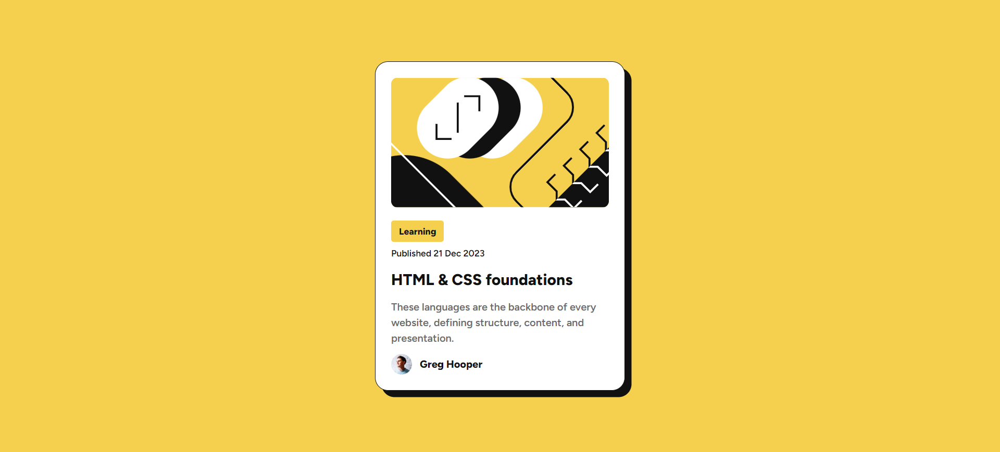

# Frontend Mentor - Blog preview card solution

This is a solution to the [Blog preview card challenge on Frontend Mentor](https://www.frontendmentor.io/challenges/blog-preview-card-ckPaj01IcS). Frontend Mentor challenges help you improve your coding skills by building realistic projects. 

## Table of contents

- [Frontend Mentor - Blog preview card solution](#frontend-mentor---blog-preview-card-solution)
  - [Table of contents](#table-of-contents)
  - [Overview](#overview)
    - [The challenge](#the-challenge)
    - [Screenshot](#screenshot)
    - [Links](#links)
  - [My process](#my-process)
    - [Built with](#built-with)
    - [What I learned](#what-i-learned)
  - [Author](#author)

## Overview

### The challenge

Users should be able to:

- See hover and focus states for all interactive elements on the page

### Screenshot



### Links

- Solution URL: [Github Repo](https://github.com/rohanpawar680/frontend-mentor-blog-preview-card)

## My process

### Built with

- Semantic HTML5 markup
- CSS custom properties
- Flexbox
- CSS Grid
- Mobile-first workflow

### What I learned

In this project, I learned how to effectively use media queries to create a responsive design that adapts to different screen sizes. I also gained a deeper understanding of how to implement transitions to create a smooth user experience.

One of the key takeaways was the importance of writing professional HTML and CSS code. I made sure to use semantic HTML5 markup and follow best practices for CSS organization and naming conventions.

Here's an example of how I used media queries to change the font-size of the blog preview card on smaller screens:

```
@media (max-width: 400px) {
  .text-preset-1 {
    font-size: 20px;
  }

  .text-preset-2 {
    font-size: 14px;
  }

  .text-preset-3 {
    font-size: 12px;
  }
}

```

I'm excited to apply these skills to future projects and continue to improve my frontend development skills.

## Author

- Frontend Mentor - [@rohanpawar680](https://www.frontendmentor.io/profile/rohanpawar680)
